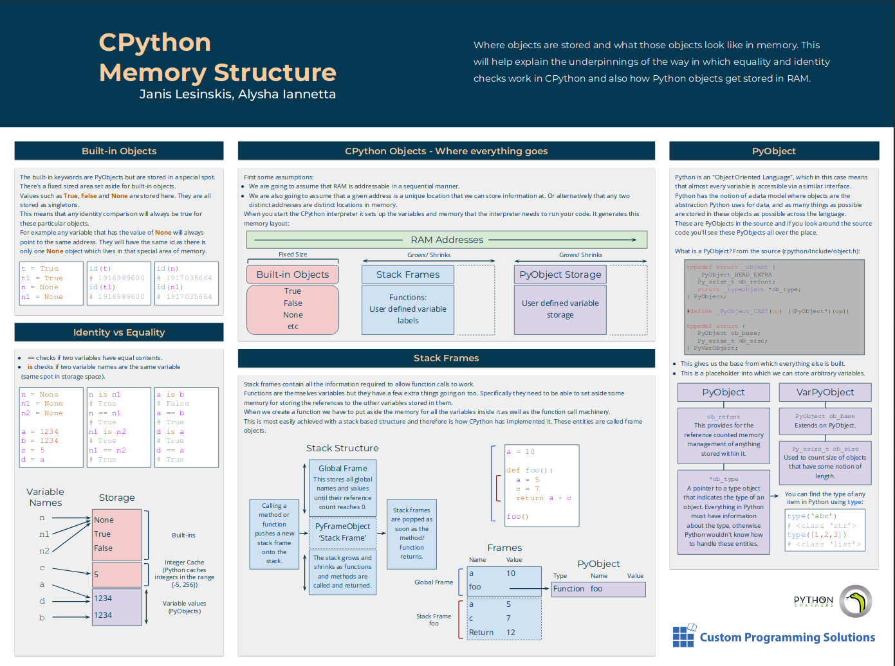

On Thursday I presented a talk about how CPython manages memory at the [Melbourne Python Users Group](https://wiki.python.org/moin/MelbournePUG).

After introducing the notion of a variable in Python and how they are stored in `PyObjects` I talked about the overall memory layout of CPython:

If you want more details the talk slides can be found here: <https://github.com/CustomProgrammingSolutions/python-memory-management-talk>
(There's a number of detailed notes in the slides with references so check out the presenter mode (by pressing `p`) to see those notes.)

Edit: Here's the poster of these concepts that this talk covered:

A high resolution download of this poster [can be found here](https://www.lesinskis.com/images/CPythonMemoryStructurePosterJanisLesinskisAlyshaIannetta.pdf)

We would like to extend our thanks to [Python Charmers](https://pythoncharmers.com/) for hosting the event!
