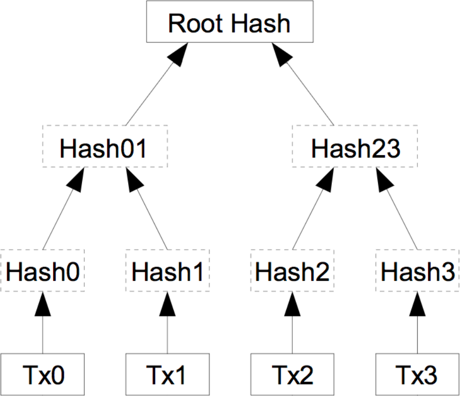
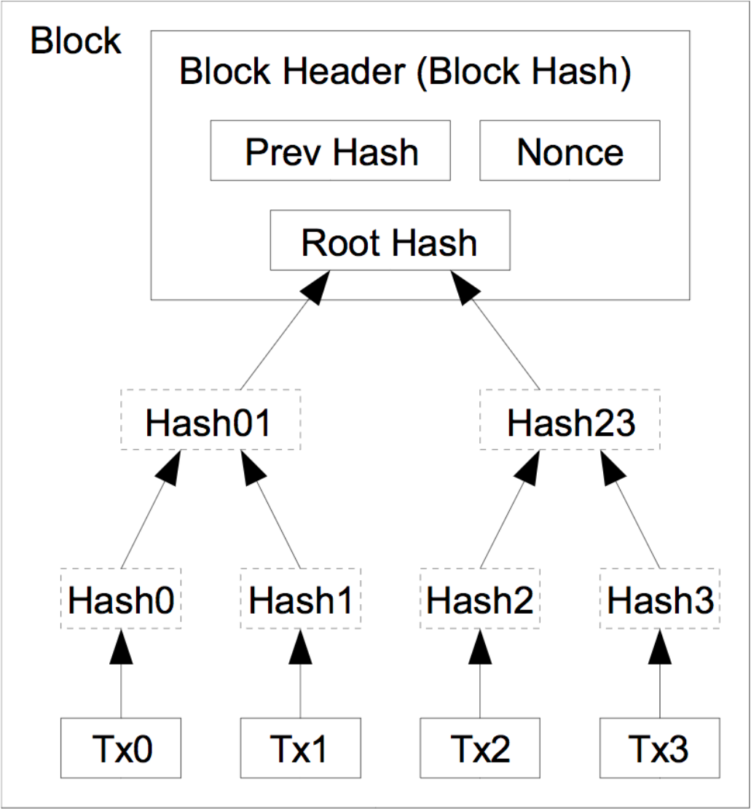

## Introduction

In this post we'll discuss the main building blocks of blockchain technology. We'll introduce concepts such as transactions, signatures through public-key cryptography, blocks, mining, proof-of-work algorithms, and touch on some of the more advanced topics such as Merkle trees, and ASIC-resistance.

The blockchain as we know it is really comprised of two parts. The first is a [communication protocol](https://en.wikipedia.org/wiki/Communication_protocol) that dictates the way in which different nodes on the network should communicate, such as which [ports](https://en.wikipedia.org/wiki/Port_(computer_networking)) to use on, how to discover and maintain a list of other nodes, and how to [serialise data](https://en.wikipedia.org/wiki/Serialization) for transmission. The other half is the more interesting side of the blockchain, built on top of the communication network; the different technologies, mechanisms and rules that together constitute the build a public, decentralised, and secure ledger. In this post, we will go through the basics of the protocols and the data structures that make up most blockchains. We will use the [Bitcoin](https://bitcoin.org) and [Ethereum](https://www.ethereum.org) blockchains to illustrate these basic ideas due to their ubiquity as the two largest cryptocurrencies, and because they best illustrate the important concepts while not being too cluttered with the complicated extra features or methods of obfuscating information that some other blockchains have adopted.

## Public-key cryptography

Blockchain technology relies very heavily on [public-key cryptography](https://en.wikipedia.org/wiki/Public-key_cryptography), and so to understand blockchain, we must have a rudimentary understanding of the cryptography behind it. Public-key cryptography, also known as asymmetric cryptography, relies on the existence of practically unforgeable [digital signatures](https://en.wikipedia.org/wiki/Digital_signature), where "practically" means that even the largest nation-states cannot crack them in the foreseeable future. What this means, is that we can generate a *private key* (some collection of data), for whom there exists a corresponding *public key*, such that given some array of bytes (a message), one can use the private key to *sign* these bytes in such a way that anyone with the public key can verify that that particular private key was used to sign them, without being able to forge a signature without the private key. This is known as a zero-knowledge proof: given only the data, signature (signed data), and the public key, anyone can verify that the signature was indeed made using that key with zero knowledge of the private key; so the signer has proved that they have access to that private key. Unfortunately we have not yet found a way to create truly unforgeable signatures, and we only have schemes that are intractably hard to crack, yet not mathematically impossible, even then they are orders of magnitude easier to crack than a brute-force attack.

In particular, most cryptocurrencies use the [Elliptic Curve Digital Signature Algorithm (ECDSA)](https://en.wikipedia.org/wiki/ECDSA) on a 256-bit [Koblitz curve](https://www.sciencedirect.com/science/article/pii/S1071579704000395) called [secp256k1](https://en.bitcoin.it/wiki/Secp256k1), whose parameters are defined in [SEC2](http://www.secg.org/sec2-v2.pdf). The cornerstone of these algorithms is that there exist some mathematical operations that are easy to do in one direction while being difficult in the other, except if you have some more information. These are called [trapdoor functions](https://en.wikipedia.org/wiki/Trapdoor_function), and in [elliptic curve cryptography (ECC)](https://en.wikipedia.org/wiki/Elliptic-curve_cryptography), this central problem is known as the [elliptic curve discrete logarithm problem](https://wstein.org/edu/2007/spring/ent/ent-html/node89.html). The mathematics of elliptic curve cryptography are unfortunately beyond the scope of this article.

## Transactions

The blockchain is centered around two fundamental data structures; transactions and blocks.

A transaction on the Ethereum blockchain can be used for a variety of purposes. The most obvious and probably the most common is to transfer Ether (ETH) from one address to another. To do so, the individual who wants to send Ether generates a transaction object, serialises it (converts it to bytes), signs it using their private key, and broadcasts it to the network. A transaction object contains things like the sending and receiving addresses, the amount, a number called a nonce, as well as a few other bits and pieces of information specific to the Ethereum ecosystem such as transaction fees and data for smart contracts. An address in Ethereum is a 160-bit number derived from the public key deterministically, and in effect, no-one can create transactions from an address without having the private key for that address.

The nonce is a number counting up the total transactions sent from that address. If it didn't exist, the recipient could perform a [*replay attack*](https://en.wikipedia.org/wiki/Replay_attack) by broadcast that transaction as many times as they wanted, re-sending that money on behalf of the sender. Bitcoin uses another method of subverting these types of attacks, by having *named coins*, achieved with transaction inputs and outputs.

Now to execute the transaction, the transaction must be broadcast to the network, and it must be accepted into Ethereum's ledger.

## Consensus rules

So how do we prevent people from creating two transactions simultaneously and sending them to different people? And who makes sure that people aren't spending more Ether than they have? Obviously we need some form of auditable *ledger*, a *source of truth*, that entities can agree on that contains the transaction histories and balances for everyone. This is the real crux, the purpose of the blockchain. The blockchain is a *decentralized*, *immutable*, *public* ledger of transactions that have been *confirmed*, or accepted, by the network and verified to be correct according to all the rules. These rules are known as the consensus rules. By "decentralized", we mean that no single computer or entity controls or governs the blockchain and that no central entity is the authoritative source of truth; by "immutable" we mean that the ledger cannot be changed after it has been agreed on; and by "public", we mean that anyone and everyone has an equal right and opportunity to join and participate in the process of building this ledger. The process of agreeing on a mutual transaction history is known as the *consensus process*, the agreed way of reaching consensus is known as the *consensus protocol*. In general, to distinguish this from the communication layer, we sometimes call these processes the *consensus layer*.

In a traditional banking situation, you might log into a bank's web application and fill in a form to transfer money; in this case, once you have broadcast your transaction (clicked send), the bank is the centralised source of truth, and you have no way of participating in the process. Furthermore, if you later convince the bank that that transaction was fraudulent, the bank is happy to go back and remove it from your history. In a decentralised system, we don't want to trust any single entity to have the authority to change history or be the arbitrator of disputes, as it would give that entity far too much power to do whatever it pleases.

## Voting

To orchestrate this kind of decentralized ledger, we need some way of voting, that is, agreeing on the direction that the blockchain is going, and which transactions are accepted and which do not follow the rules. If we implemented some form of simple voting rule where every computer had one vote, say one vote per [IP address](https://en.wikipedia.org/wiki/IP_address), hackers could easily take control of the blockchain, by either using some kind of [botnet](https://en.wikipedia.org/wiki/Botnet) with thousands or even millions of computers, or by pretending to have more computers than they really did by [spoofing IP addresses](https://en.wikipedia.org/wiki/IP_address_spoofing) or just having many IP addresses pointed to one node, known as a [Sybil attack](https://en.wikipedia.org/wiki/Sybil_attack). To overcome this, most blockchains use an ingenious way of voting called proof-of-work which works by dividing the votes based on how much computing power each entity has. The rationale is that it is much harder and more expensive to seize a sufficiently large proportion of the computing power on the network than it is to take over enough computers.

### 51% attacks and double spending

The case in which a fraudulent entity controls the majority of the computing power and can fraud other entities on a blockchain is rightly called a 51% attack. It's important to understand that even if someone were to amass even 99% of all computing power on the network, they couldn't *steal* cryptocurrencies; this is ensured by the cryptography used. They could *double spend*; they could submit a transaction to the blockchain, let it be confirmed and wait for receiver to start believing that it is immutable and transfer the good being paid for, but then when they had received the goods for that transaction, they could recreate a new history and ledger, a new *fork* of the blockchain, in which that transaction was sent to someone else. This is a way of reversing a transaction by double spending. There are some other hacks that can be performed with sufficient voting rights, such as denying (or making it more difficult) for target individuals to use their cryptocurrencies (by regularly trying to not confirm their transactions). A fraudulent entity doesn't even necessarily need over half of the voting rights, in fact, with only 30% of computing power, someone can successfully recreate a 5-block transaction history 17.7% of the time.

## Hashing and Merkle trees

Before we go on to discuss how exactly this voting mechanism works, we must discuss two related concepts, a cryptographic primitive called hashing and a data structure known as a Merkle tree.

### Cryptographic hash functions

A [*cryptographically secure hash function*](https://en.wikipedia.org/wiki/Cryptographic_hash_function) is a function that takes as an input an arbitrary number of arbitrary bytes, and produces a fixed length output called a *hash* with a few crucial properties. Essentially, the idea is that the output looks random, and it is very hard to produce inputs that give a certain output hash. This property is known as [pseudorandomness](https://en.wikipedia.org/wiki/Pseudorandomness). More rigorously, the output for any given input should always be the same, the output should be very sensitive to inputs so that changing the input slightly changes the output completely, and finally, given an output it should be almost impossible to create an input that produces that output, and it should even be almost impossible to create two inputs with the same output.

The following snippet of [Python](https://www.python.org/) code illustrates the way in which a slight change in the input drastically changes the output. The hash function used is [SHA-256](https://en.wikipedia.org/wiki/SHA-2), the hashing function used throughout Bitcoin.

```python
>>> from hashlib import sha256
>>> def sha_hash(input_string):
...     _bytes = input_string.encode('utf-8')
...     digest = sha256(_bytes).hexdigest()
...     print('The hash of "{}" is "{}".'.format(input_string, digest))
...
>>> sha_hash('This is an illustration.')
The hash of "This is an illustration." is "cc60b0d0b6c02f3ebb026a3c6487a6a891179224313531e5eaecb989eec4565a".
>>> sha_hash('This is an illustration!')
The hash of "This is an illustration!" is "82a52d1f876eca019919de34365ac37ffac3f00ce2f6c75260005df2043383b5".
>>> sha_hash('This is an illustration?')
The hash of "This is an illustration?" is "cecf000fb26efec9c32624703582f56deb5ff24f08f3ae1501dd4a336bf491bc".
```

So what's hashing good for? Suppose that I send my friend a very large file over the internet, but I have a suspicion that someone may have tampered with the file while it was being transmitted. One way of [verifying that we have the same file](https://en.wikipedia.org/wiki/File_verification), is for both of us to compute the hash of that file, and then for me to call my friend and spell out the hash of that file while he verifies that he has the same hash (it would be very hard for an attacker to imitate the voice and mannerisms of my friend over a phone call). Because it's almost impossible for someone to generate another file with the same hash, my friend and I now have pretty much no doubt that the file is untampered with. Another neat property here is that because the hash is supposed to drastically change even with a small change in the input, it doesn't really matter if my friend doesn't hear every character of the hash exactly over the phone, since if the file was modified, the hash would change completely.

One handy property of hashing which is often overlooked outside of the blockchain world is the pseudorandomness of cryptographic hashes; the output behaves close to randomly and unpredictably given an input, that is, if we think of the output as a number, that number is uniformly distributed between zero and the maximum hash (in the case of a 256-bit hash, the maximum will be 2^256). This is a key insight that is used in the proof-of-work algorithms that we'll discuss soon. It is also one of the properties that allows us to create highly attack-resistant [distributed hash tables](https://en.wikipedia.org/wiki/Distributed_hash_table), such as those in [S/Kademlia](https://ieeexplore.ieee.org/document/4447808/) and the one used in the [InterPlanetary File System (IPFS)](https://ipfs.io/).

### Merkle trees

The other important concept we need to understand before proceeding is the idea of a [*Merkle tree*](https://en.wikipedia.org/wiki/Merkle_tree), also known as a hash tree. This data structure is really just a complete [binary tree](https://en.wikipedia.org/wiki/Binary_tree) of hashes. Every leaf node is the hash of an object, in our case a transaction, and then the value of every non-leaf node of the tree is given by the hash of the two nodes underneath it (that is, the hash of the concatenation of the hashes underneath). On one hand, this is simply a way to hash a whole lot of data together, and for that purpose we could equally well concatenate all the hashes for these bits of data and hash the result, but on the other hand, using a hash tree gives us a couple useful of extra properties for free that we'll discuss next.



Take the example above where I'm sending a friend of mine large files. Imagine that instead of just sending one file, I sent out millions of files, and this time, my friend doesn't need to verify all the files, only a few. So say there is one file that contains important information, and a whole lot of unimportant files. If I had simply concatenate the hashes for each file and hashed the result, my friend would now have to compute hashes for millions of files. If instead I computed a hash tree like this, I would only have to send him the hash of the file, as well as the hash of every node on the path to that file in the tree. However, since we are using a complete tree, the path length for a million items is at most 20 items long, so instead of my friend having to compute a million hashes, or me having to send them a million hashes, it suffices to send out 20 hashes and verify those. Not only this, but I could also send the 19 non-root hashes through an insecure channel and only verify the root hash through a phone call or similar secure channel. This is the basic idea behind a *Merkle proof*. In the diagram above, suppose I wanted to verify the object `Tx2`. It would be enough for my friend to send me `Hash3` and `Hash01`, and verify `Root Hash` over the phone, since I could compute `Hash2` and `Hash23` myself.

In addition to this, Merkle trees give us another free little gimmick. If it happened that my friend and I decided that we don't care about most of those files anymore and deleted them, we wouldn't need to keep the hashes of all the deleted files around anymore. If we deleted a subtree of that hash table, we'd only need to keep the hash of the root of that subtree to perform Merkle proofs on the remaining files. Replacing files with transactions, these are the ideas that allow Bitcoin clients to prune their database of already spent transactions and potentially save some disk space. This process is known as *pruning*. Again, in the diagram above, if we permanently decided that we don't care about transactions `Tx2` and `Tx3` anymore, we could both get rid of `Hash2` and `Hash3` and only retain `Hash23`, the only hash we need to use the tree for transactions `Tx0` and `Tx1`.

## Miners and Blocks

An entity that is taking part in the consensus process for Bitcoin by voting in the system is called a *miner*. A miner will continuously bundle several transactions into a *block template*, and perform work on trying to find a new block. A block template is a block such that if we were to add it to the ledger (the current chain of blocks), that ledger would be correct; meaning that all the normal rules of money are satisfied, for instance such that no money was created out of thin air and no money was sent to multiple people at once. In Bitcoin, a block is a fairly simple data structure, containing some essential metadata, the list of transactions to be included, and a Merkle tree of transaction hashes. The block is divided into two parts, the *block header*, and the body. The body contains the transactions and the Merkle tree of transaction hashes, whereas the block header is very small and only contains a version number, the previous block hash, the root hash of the transaction Merkle tree, the timestamp, a quantity related to the difficulty in mining blocks called nBits, and finally a number called a nonce.



## Proof-of-work

Once a miner has collected some transactions from the network, assembled them into a Merkle tree, and computed the hashes for that tree, they combine these with the version number (currently 0x20000000), the hash of the last block, the timestamp, the nBits number, and the nonce. The miner then hashes the header of this block template to get a 256-bit hash. The miner compares this number to a quantity called the target threshold, and if the hash is lower than the target threshold, this block is valid. If the block is not valid, the miner will change the nonce and recompute the hash to get a different, random number, repeating this until they find a hash that is small enough, or more likely, someone else finds one and they receive a new block. When one of the miners on the network eventually happens to get a hash that's below the target threshold and creates (mines) a valid block, they will broadcast that to their peers on the network, where each of their peer nodes will verify that the block is indeed valid (this is a relatively fast process), and then broadcast it forward. When a mining node receives a new valid block, it adds it to its local chain, stops mining on top of the old block, and starts mining on the new block. There is no point in mining on top of the old block, as other nodes will have now moved onto the next block and won't accept other blocks on top of the old one anymore. 

So the process of mining is really just recomputing these hashes until someone finds a hash that is lower than the target. Mining is like some form of global lottery of who finds a hash first. To get an idea of the numbers at play here, the probability of a random hash being below the threshold is approximately one in 10^23. To put this in perspective, 2 grams of carbon is made up of close to this number of carbon atoms.


The nonce is an arbitrary number that has no other purpose than to slightly modify the input for the hash function so that the output hash will change to something completely random. Normally a miner might start from nonce 0 and increment it one at a time while mining blocks.

The target threshold itself is updated every 2016 blocks (around every 2 weeks). It is adjusted so that if the hashrate were to be kept constant at the time of updating, the next two weeks of blocks should happen on average every 10 minutes. The nBits number is really just this target threshold, encoded in a special way as a floating point in base 256 (scientific notation).

While a miner is looking for a low enough hash, they will occasionally recrate the block template, in case new transactions have been broadcast that would yield a higher block reward, or to update the timestamp.

To recap, to mine Bitcoin a miner first bundles transactions into a block template, then computes the hash of the block header, and keeps on changing the nonce until the hash of that block header is below the required target threshold, or until it receives a new block that someone else already mined, at which point it will create a new block template but change the last block to point to this new block and select a new list of transactions (that is, they will start mining *on top of* the new block). Mining on top of an old block while a new block is being propagates (before the miner has heard about it), is called mining on a *stale* block.

Note that to start mining a new block, you must know the hash of the last block header; meaning that you can't start mining a new block before the last one has been found.

Mining other cryptocurrencies is very similar. The Ethereum blockchain has a more involved *state* stored in a data structure known as a *trie* (a special Merkle-Patricia tree), and has some added bells and whistles, so its block headers and blocks contain a lot more data. However, the hashing process is similar, it uses a different hashing function, but the mechanism of finding a sufficiently small hash remains.

### Block delay

It is important that blocks are not too easy to find. If they were found, say every second, then several miners would find blocks before they could be relayed across the network and chaos would ensue. In the worst case, the network may split where one set of nodes would diverge and mine on a different chain, whereas another selection would mine another. This would be catastrophic as now the two ledgers would diverge and people in different places would have different ideas on who has how much money. Experiments have shown that blocks often take approximately 12.6 seconds to propagate across the network. On the other hand, a lot of people believe Bitcoin's block time of 10 minutes is way too long; and a lot of newer cryptocurrencies have reduced this significantly. In Ethereum the blocktime is close to 15 seconds, but it has also had to include special rules for rewarding people who accidentally mine stale blocks, and so forth. These changes are necessary with slower block times as otherwise powerful miners gain an additional efficiency boost due to the time it takes others to receive their blocks, reducing decentralisation.

### Block reward

The miners themselves are incentivised to mine for two reasons. Firstly, there is a block reward, called a *coinbase transaction* in Bitcoin that miners can add as the first transaction in a block. This transaction *mints*, or creates a predefined amount of Bitcoin that is transferred to an address of the miner's choosing. This amount halves about every 4 years and is currently 12.5 BTC. Halving it like this means that the total supply of coins to ever exist [doesn't grow indefinitely](https://en.wikipedia.org/wiki/Geometric_series) but is rather finite, in the case of Bitcoin, at 21 million. The second incentive to mine is in transaction fees. Every transaction can nominate an amount as a fee, which incentivises miners to include that transaction in the block. Blocks themselves have a size limit (in Bitcoin, this is roughly speaking 1 megabyte per block, though the segregated witness fork, or SegWit, changes this somewhat), so miners will generally include the transactions with the highest fee per byte of data. The transaction fee also increases the cost of spamming the network and blockchain with unnecessary extra data.

The proof of work also reduces the viability of distributed denial of service attacks. Each node on the Bitcoin network is supposed to verify the block before they relay it on to their peers; so if there was no proof of work, anyone could spam a given node with many *valid* looking blocks that end up not being correct, wasting computations power from the node being attacked. However, because of the proof-of-work algorithm, it is trivial to check whether a block is valid simply by computing one hash; an extremely fast computation. Therefore, it is very difficult to perform any kinds of denial of service attacks without a lot of computational power to generate valid blocks; and even then, it would probably be smarter to use that power to mine the particular cryptocurrency than to try to attack the network.

There are a lot of other subtle benefits to using this proof-of-work method. For instance, suppose that my friend claims to have sent me some Bitcoin, but I don't have a copy of the whole Bitcoin blockchain on my phone. To convince me that they sent some Bitcoin, my friend simply has to send me the block that contains that transaction (which is currently a maximum of around 1 megabyte), as well as the block headers of all blocks up to some point that I know and some blocks after that block. Now since I can very easily check that the hashes of those block headers are correct, and since they are very small numbers, I am convinced that it took a lot of computing power to generate the corresponding blocks, so my friend couldn't possibly have forged them (or even a nation-state pretending to be my friend).

In fact, as we discussed earlier, because transactions are placed in a Merkle tree in the block, we only need to send out the hashes of the parts of the tree needed to compute the root hash. On the current Bitcoin network, a block may have anywhere up to around 2200 transactions, whereas a Merkle proof only requires some 12 hashes, a data reduction of over 99.5% (we still need to transmit the fixed size block headers though, but those tend to be quite a bit smaller).

### ASIC-resistance

Unfortunately, it is not hard to create custom electronic circuits called [application-specific integrated circuits (ASICs)](https://en.wikipedia.org/wiki/Application-specific_integrated_circuit) that compute these hashes extremely fast. This means that no-longer can normal individuals really benefit from mining Bitcoin, as it is only those with special hardware who get a massive boost and so mine blocks much more often. Some see this as problematic, as control of the blockchain is then disproportionately handed over to big players with the capability and funds to create and operate custom chips. To overcome this, there are several other ways of assigning votes based on computing power in such a way that one cannot build these chips easily, often called ASIC-resistance. Ethereum achieves some of this by using its own proof-of-work algorithm called Ethash which requires hashing certain information about the chain in a pseudorandom order way. This hashing pattern is built so that it is much faster to create a very large cache (1 GB) of the most common hashes instead of recomputing them each time. This means that although the hash is possible to compute without a lot of memory, trying to find a hash becomes much cheaper if one has a large amount of memory which is hard to get on a custom chip. This is a method of gaining ASIC-resistance through being *memory-hard*. Although it becomes orders of magnitude faster to use the cache, and so all miners will want to use it, it is still extremely fast to compute the values on the fly, so verifying blocks with little memory is still efficient and can be done without the cache.
