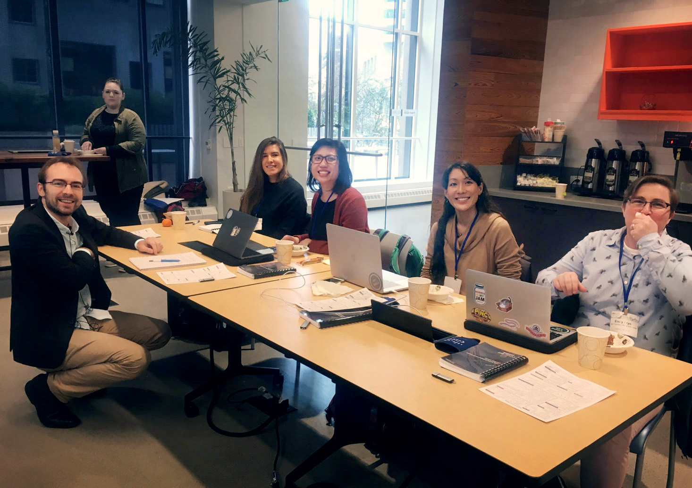

The story of our partnership with Python Charmers

<!-- end excerpt --> 

*CPS co-founder Janis Lesinskis (left) with some attendees at a Girls in Tech workshop in February 2019. He co-facilitated the workshop on intermediate web development skills in Python with Dr Ed Schofield, director of Python Charmers.*

Flashback to early 2018: CPS was striving to grow our base of consulting clients. Through a local meetup, we discovered the [Python Charmers](https://pythoncharmers.com/), the leading Python training and consulting company in the Asia Pacific Region. This is the story of our partnership: how we met, why we work together and what we're hoping to accomplish as we look to the future. 

We met the Python Charmers group via the [Melbourne Python Users Group Meetup](https://www.meetup.com/Melbourne-Python-Meetup-Group/), where I'd had some discussions with one of their team members about how I, as a senior Python developer, could upskill. Since I had experience in educating other professionals and was frequently doing talks about Python in Melbourne, they offered me a position teaching introductory to intermediate level Python courses and web development workshops with their group. 

The teaching position not only gave me the opportunity to work closely with Python Charmers, it also gave me the chance to upskill and run some comprehensive workshops. The company is always looking for highly skilled Python experts and facilitators, but this combination is difficult to find. 

At the same time, CPS was shifting to consulting and focusing less on offering educational services (especially after learning some valuable lessons about the market with an earlier failed Stacked Training venture). 

Python Charmers' stellar reputation for offering extremely high-quality training and good standing in the tech community, makes them an ideal partner for these sorts of projects. This also provided a great opportunity to introduce ourselves as consultants. When people see that they're investing in a good quality product created by highly skilled professionals, this puts their minds at ease - one of the most common fears for event planners and others is unwittingly hiring unskilled consultants. (I co-facilitated a [Girls in Tech](https://girlsintech.org/) workshop focusing on intermediate web development skills with [Ed Schofield](https://www.linkedin.com/in/edschofield0/), director of Python Charmers, in February 2019, and had a fantastic time. [Read more about that here](https://www.lesinskis.com/GIT_workshop_San_Francisco_February_2019.html).)

This partnership came along at exactly the right time. We agreed to refer any Python-related training to Python Charmers for a fee, and in return, any consulting work would be referred to us.

With this arrangement, each of our organizations was able to focus on our core competencies - a huge win for both! 

We're excited to collaborate on even more projects and even attend some events in the near future. If you're attending [PyCon US 2019](https://us.pycon.org/2019/) in May in Cleveland, Ohio, come see us - I'll be presenting a poster in the posters section, and this will likely be a joint presentation courtesy of CPS and Python Charmers. 

