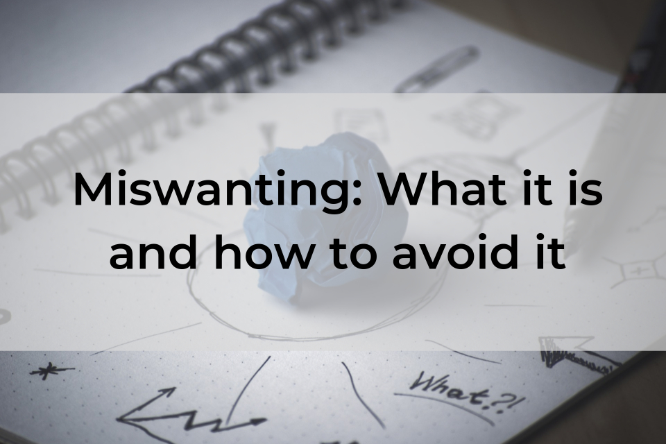

We humans like to believe that we know what we want, and will continue to want those things in the future. But sometimes, that isn't the case and we make an inaccurate prediction about how and what we'll feel when we finally get that thing - we *miswant* something. So, what exactly is miswanting? How do we avoid it, and the subsequent impacts of a poor prediction or bad decision? We'll cover that in this post.

<!-- end excerpt -->

Think back to when you were a kid. If you were lucky enough to get a weekly allowance or birthday money from relatives, you'll remember your heart pounding with excitement over saving your cash to buy a major big-ticket item like a video game console or the latest gadget you've been eyeing. 

Or, maybe you were less patient and splurged on something that had caught your eye as soon as the dough landed in your pocket. Sometimes, you felt confused after bringing your newest purchase home, unwrapping it and...being disappointed or underwhelmed with something you were positive you wanted. If this sounds familiar, you've suffered from an unfortunate case of *miswanting*.  

We humans like to believe that we know what we want, and will continue to want those things in the future. But sometimes, that isn't the case and we make an inaccurate prediction about how and what we'll feel when we finally get that thing - we *miswant* something. So, what exactly is miswanting? How do we avoid it, and the subsequent impacts of a poor prediction or bad decision? We'll cover that in this post.

Psychologists Dan Gilbert and Tim Wilson, who study *affective forecasting*, [define *miswanting*](https://www.apa.org/science/about/psa/2004/04/pelham):

> Miswanting refers to the fact that people sometimes make mistakes about how much they will like something in the future. That is, people often mispredict the duration of their good and bad feelings. 

While it's disheartening to waste $5 on a toy that ends up at the bottom of your closet, once we get older, the consequences of miswanting can be much more serious: Maybe we're tasked with making what may be million-dollar decisions about the direction of a project, features we need in our software, hiring a new team member or the recruiting process itself. These are times we can't afford miscalculations. One critical mistake could mean we chart the wrong path and end up with a solution that doesn't satisfy our pain points or solve our problem. In worst case scenarios, jobs or investors could be lost, and projects cancelled.

*When planning new projects, it's essential to remember the danger inherent in miswanting. Do not add more complexity to a new system than is absolutely necessary - you can always add features iteratively.*

For example, imagine the following situation: Paul is an IT manager for a manufacturing company with 150 employees. He needs to find a better system for employee onboarding because the company's current process is piecemeal and convoluted. He's even a bit embarrassed by it, so he commits to tackling the issue.

First, he consults his HR department (and any others involved in the onboarding process) to define their needs, then starts shopping for an agency to build a custom, web-based app where every new employee's information, the documents they exchange with them, and training materials will be centralized. 

He started this process with a list of basic requirements he knew he definitely needed, but then he read a well-written article in an industry magazine detailing the benefits of a few features that weren't included in his inventory. These new features sound so much better than what he and his staff had agreed to originally. Besides, what good is a system they may have to upgrade and retrain on in a year or two? 

Paul fears that by not giving his staff the best possible system, he'd be shortchanging them. He's convinced they need these features, so he tables it with both the agency he hired and his staff. While the agency agrees with him and jumps at the chance to further customize (and make more profit from the project), the employees discourage adding to the feature list. They contend they'll already have to learn a new system. Why add extra complexity where it's currently not warranted (and potentially will never be used)? After a couple of weeks of arguing, they relent and Paul signs off on the deal. Six months after implementation, Paul is dealing with some livid staff and one confused new employee. He's bewildered at how he was conned into wanting something he thought he liked the looks of, even needed. 

In the conclusion of a [paper titled "Miswanting: Some Problems in the Forecasting of Future Affective States", which summarizes their study](https://dash.harvard.edu/handle/1/14549983), Gilbert and Wilson explain how our wants can steer us wrong, even when we're sure of them:

> First, our wants are, like any other prediction, susceptible to error. We may misconstrue events, misunderstand ourselves, misinterpret our feelings - and any of these mistakes can be a cause of miswanting. In short, things do not always feel the way we expect them to feel. Second, even if we could predict how much we would like an event when it happened, we might still be unable to predict how that event would affect us in the long run.

In this case, we can take a few lessons from the example above:

- Having no system is very different to having a system, and again very different than having a complex system.
- Paul let his embarrassment about and memories of the non-existent system his team had in the past cloud his judgement about requirements. 
- He overlooked the downside of moving from no system to a complex system, and assumed  a complex system with more features meant it would be a better system. In reality, the complexity negatively impacted his staff. 

Sometimes, when complex systems are implemented, those using it find that not only does it not live up to expectations, but they may actively *dislike* the system they receive. 

## How to avoid miswanting when making decisions

So, how do we avoid *miswanting* something, and the resulting financial and interpersonal disasters? Here are some tips to keep in mind: 

- Understand the difference between "liking" and "wanting"; wanting is a prediction of future liking. Specifically, when people dislike their current systems and they think of a future with different systems they will like, the prediction of this future is a potentially dangerous (and fascinating) source of errors.

- Be wary of letting emotions about the past dictate your actions in the present. 

- Remember that with new systems, sometimes it's better to make progress iteratively than introduce huge milestone changes that overwhelm your team and don't satisfy your requirements. 

- If you're making decisions on behalf of a group, understand and listen to their requirements. Have a high standard for making significant changes to scope after the project has begun.

## Conclusion

Miswanting involves making poor decisions about what we think we'll like in the future. By understanding the term and admitting that we're vulnerable to this psychological trap, we can avoid falling prey to it, improve our decision-making skills, and save precious time and revenue.
