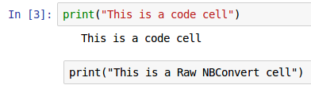
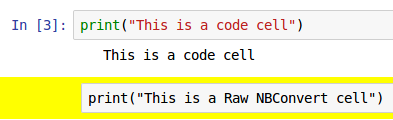

When using Jupyter notebooks have you found the styling of code cells to be too visually similar to Raw NBConvert cells? We found the similarities in formatting made it visually harder to see when a cell was set to the wrong cell type when we were running workshops and editing our own data science notebooks. Here's how we changed it.

<!-- end excerpt -->

[Raw NBConvert](https://ipython.org/ipython-doc/3/notebook/nbformat.html#raw-nbconvert-cells) let you pass whatever you want through to the NBConvert function without any processing. This is great when you want to run NBConvert to turn your notebooks into various other output formats.

You may have a situation, like the educational workshops we sometimes run, where you are using a notebook just to demonstrate concepts and don't have any need for the Raw NBConvert cells. In such a case it's really good to be able to _visually_ distinguish these cell types from code cells because it makes it far easier to see at a glance when someone has chosen the wrong cell type. (We have seen that beginners can find these cells to be a gotcha where the issue of having the wrong cell type is not immediately obvious at a glance)

Even if you do need to use the Raw NBCovert cells making them visually distinct helps eliminate many mistakes. Making code that's correct look correct and making code that is not correct look incorrect is very valuable.

We make use of the fact that the CSS classes for a Raw NBCovert cell include `text_cell` AND `unrendered`.

## From code - using jupyter magic

We make use of the `%%html` magic cell to influence the HTML that displays the notebook itself like this:

```
%%html
<style>
.text_cell.unrendered {
  background-color: yellow;
} 
</style>
```

## From code - using IPython.core.display

This is functionally the same as the `%%html` magic cell approach above.

```python
from IPython.core.display import HTML
HTML("""
<style>
.text_cell.unrendered {
  background-color: yellow;
} 
</style>
""")
```

## Before and after

This is what it looks like as a default:



And this is what it looks like after the CSS change:



It's far more obvious at a glance that these are different by changing the background color.