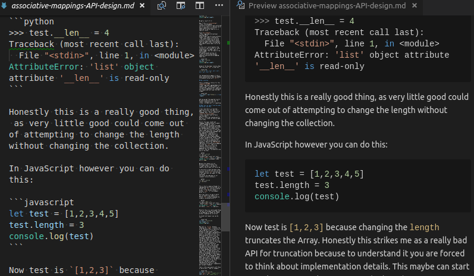
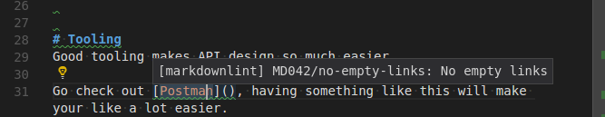

Even before we moved our site to a [JAM stack](https://jamstack.org/) we found that we edited a number of [Markdown](https://en.wikipedia.org/wiki/Markdown) files every day, for example those README.md files on our GitHub repositories and various other bits of documentation.
Here's some of the things we have found helpful in making a good workflow for editing Markdown documents.

## Use an editor that properly supports Markdown

Because Markdown is not [WYSIWYG](https://en.wikipedia.org/wiki/WYSIWYG) you don't see what the documents look like until they have been rendered.
As with anything else having a long feedback loop definitely impacts your productivity, most notably because it risks interrupting the flow of your writing if you have to build the pages to validate that they work.
This post is about how to make a good workflow for editing Markdown content that has a short feedback loop.
Getting any extra efficiency for performing frequent tasks such as this is a noticeable win.

Using an editor that properly supports Markdown is a huge boost to your productivity but comes at no extra cost (it's a classic example of a non-tradeoff).
At a minimum you'll want syntax highlighting and linting for almost all Markdown editing workflows.
If you are blogging or writing technical documentation a spell checker and an automatic preview are also extremely useful.
The following examples should show why these are worth setting up:

## Syntax highlighting

Because Markdown is a markup language an editor that will do proper [syntax highlighting](https://en.wikipedia.org/wiki/Syntax_highlighting) is very useful when editing Markdown files. As such we often edit Markdown with [Vim](https://www.vim.org/) or [VS code](https://code.visualstudio.com/).

Since Markdown is stored in plain text you could use any text editor but one that is designed for editing code will provide a _substantially_ better user experience for editing. Proper syntax highlighting in particular lets you more readily see the structure of what you are doing and makes it easier to spot mistakes.

One really good feature of editors that support Markdown well is that they highlight the code blocks with the same syntax highlighting for that language. This makes writing articles containing code snippets much easier. Notice in this screen-shot how JavaScript and Python are both highlighted properly.

## Live preview

One of the main issues with editing Markdown is you have to render it to see what it looks like.
Some editors support a live preview where you can see the rendered document side by side as you are writing it.
When we are writing blog posts we find this to be very useful because we are interested in how the document looks when rendered and this makes the feedback loop time instant.

Take for example the example snippet seen above, this is what it looks like in our editor:

Having the live rendering preview gives us almost all the benefits we would want from a more [WYSIWYG](https://en.wikipedia.org/wiki/WYSIWYG) system without the downsides from such a system (like being unable to use version control software as effectively).

## Linting via VS Code plugin

There are a variety of tools that will check that your documents are in the right format and are free of errors.
Using such tools is helpful but the reduction in feedback loop time from having them directly integrated in your editor is transformative.

Seeing as we use VS Code already we can install a [Markdown linter extension](https://github.com/DavidAnson/vscode-Markdownlint) that gives immediate linting for our Markdown files.

So for example have a look at this screen-shot from when I was writing a draft for a post on here:

Because of the integration with the IDE I'm getting immediate feedback in my editor that something is wrong via those green squiggly underlines, I don't have to generate the pages to catch these errors and every time I can catch a mistake faster is a productivity gain.
Consider I didn't have a linter, in the best case scenario I'd have spent a few seconds to see this is an issue and fixed it.
In the worst case scenario I occasionally might have missed the mistake and it could have ended up published to the site, beyond it looking bad the act of fixing that now takes minutes or longer.

## Spell checking

It's great to have a spell checker in the editor if you are editing a lot of Markdown content. This allows you to get immediate feedback about spelling mistakes which will let you be more productive and write higher quality content.

VS Code has a [spell checking plugin](https://github.com/Jason-Rev/vscode-spell-checker) that we install for our Markdown editing environment.